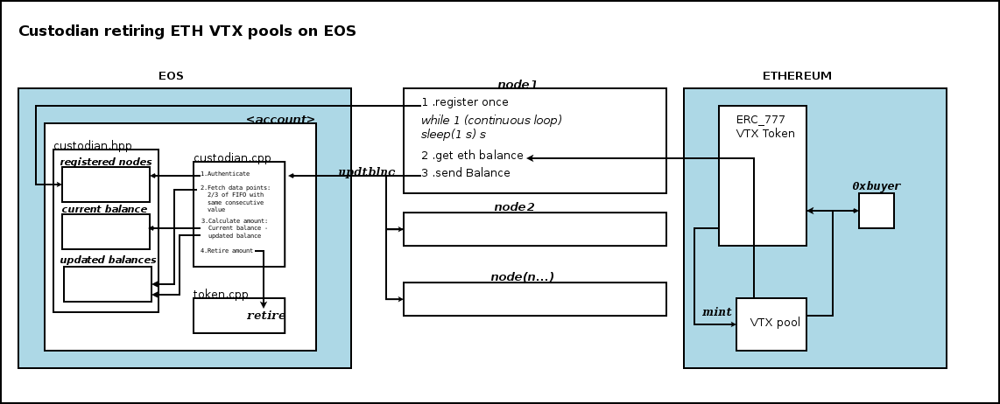

Introduction 
============

Wrapped tokens are each backed by an equal amount of another asset. In
this case, a pool of ETH VTX tokens is backed by a pool of VTX tokens on
EOS to which a corresponding amount of original VTX token was sent. The
synchronisation of the initial EOS VTX with ETH VTX is ensured by:

1.  An oracle script executed by the nodes on the Volentix network,
    constantly feeding an EOS contract with the ETH VTX balance, account
    name, timestamp, block info etc\...

2.  A smart contract on EOS validating this balance

3.  The retiring of EOS VTX by this contract according to the new
    approved balance

System flow
===========

In the EOS contract, an initial unique record of the ETH VTX balance is
kept as a reference. This record is updated anytime the EOS contract
determines the ETH pool balance has changed. For this, the EOS contract
is continuously fed the VTX balance of the corresponding VTX pool on
ethereum by registered vdexnode oracles. The EOS contract inserts these
balances in a circular buffer, determining how many consecutive similar
balances there are to the last incoming balance. If it was the case that
the last 2/3 of the transactions were the same, The difference between
the last recorded unique balance record and the new ethereum balance is
calculated and the amount is sent to be retired on from the from the
total VTX supply on the EOS chain.

{#fig:whitebackground-ecosystem02}

Conclusion
==========

Custodians trade assets for wrapped tokens by minting (creation of
wrapped tokens) and burning (reducing supply of wrapped tokens). The
latter has been accomplished in this iteration. This mechanism can be
used to to synchronize pools regardless of their provenances, as long as
a the EOS contract is fed with the concerened balance.
